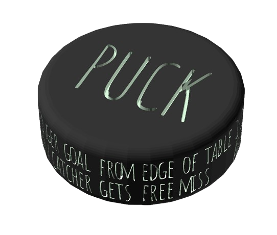

# Puck™

### What the Puck?!

## What you need to play the game

You only need **2** things to play:

- A **puck**
- A table

If you have a 3D printer, you can download the [offical Puck™ puck here](./puck/puck.stl).

If you have Pucket™, then the pucks are a similar (the exact same) size.

Failing that, just cut a 13mm piece of a 35mm dowel.

## Rules

Two players either side of a table.

One player spins the puck towards their opponent.

The opponent then attempts to catch the puck between their thumbs.

If they are successful in catching with only their thumbs, the opponent creates a goal with thier hands at the edge of the table.

They then try and shoot a goal from where they caught the ball, without repositioning the puck between their thumbs from when they caught it.

The spinner and shooter then swap.

First to 5 wins.

## Things of note

### Advantage Rule

If the spinner spins the puck off the table, the shooter then has advantage. The spinner then spins again, but if the catcher misses/drops the puck they get another spin to try again.

### How to make a goal

### Dropped the puck before getting to shoot?

Tough luck, so long as your opponent created a goal for you right away.

### Fingers are not thumbs

If any other part of your hand touches the puck, its not a catch.

## Custom Puck™s

You can create your own puck by editing the OpenSCAD model found [here](./puck/puck.scad).
